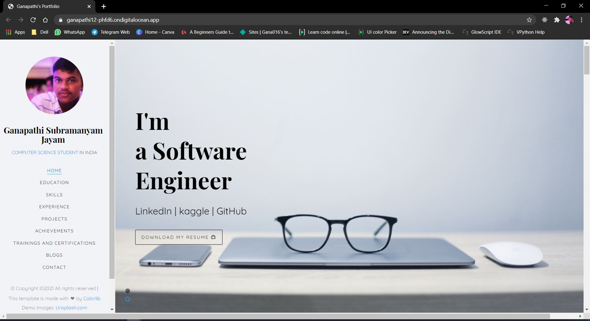

My Portfolio Website

## Setting up development environment

- Clone : `git clone https://github.com/ganapathi12/ganapathi12.github.io.git`
- Install all dependencies : `npm i`
- Run the app : open `index.html`

### Screenshots

